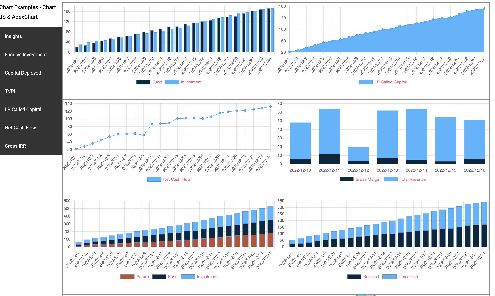

# Angular Chart App

This project was generated with [Angular CLI](https://github.com/angular/angular-cli) version 14.2.8.

`To clone this app` :  git clone https://github.com/mahadevanvaradhan/chartjs-demo.git

Run `npm install`

Run `ng serve  --open` for a dev server. Navigate to `http://localhost:4200/`. The application will automatically reload if you change any of the source files.

## Firebase deployment

$firebase login
$firebase use --add
$firebase deploy

#### link to demo chart: https://chart-js-ts.web.app/
